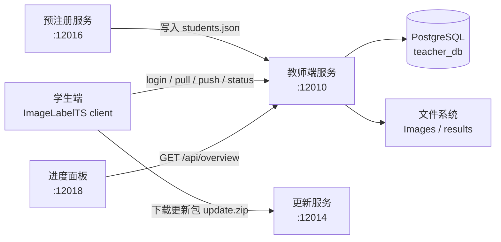
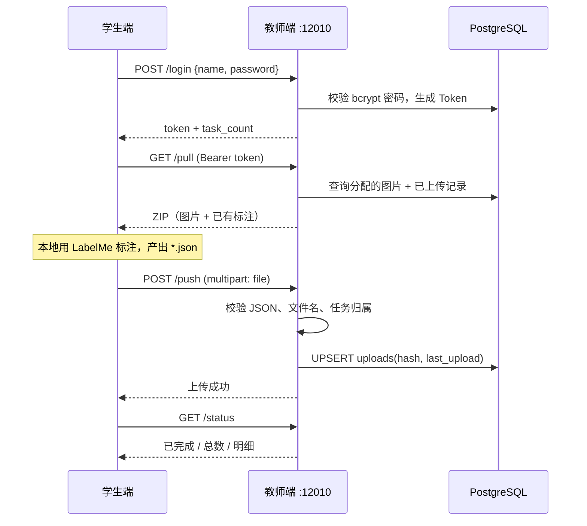

# ImageLabelTS

**ImageLabelTS** 是一套面向教学场景的**图像标注任务管理平台**。教师通过服务端把待标注图片随机分配给每位学生，学生在本地使用 [LabelMe](https://github.com/wkentaro/labelme) 完成标注后回传结果，教师与管理员可通过 Web 面板实时查看整体进度。

系统围绕 **拉取（pull）→ 本地标注 → 推送（push）** 的核心闭环设计，并配套了注册、进度面板、客户端更新分发等辅助子系统。

---

## 1. 系统组成

| 子系统 | 目录 | 技术栈 | 默认端口 | 作用 |
|--------|------|--------|----------|------|
| **教师端服务** | `teacher/` | Python · Flask · PostgreSQL | `12010` | 认证、任务下发、结果接收、进度统计的核心服务 |
| **进度面板** | `dash/` | Python · Flask | `12018` | 面向学生 / 管理员的 Web 进度看板，读取教师端 `/api/overview` |
| **预注册服务** | `pre-registration/` | Python · Flask | `12016` | 学生自助注册，写入 `students.json`（bcrypt 哈希） |
| **更新服务** | `update_server/` | Python · Flask | `12014` | 分发客户端更新包与 `update.ps1` 升级脚本 |
| **学生端客户端** | `student/` | C# · .NET 10 WinForms | — | 登录、下载任务包、上传标注结果、查看进度 |
| **文档** | `docs/` | Markdown | — | 客户端使用手册等 |

---

## 2. 架构概览



典型的三层结构：

1. **表示层**：学生端 WinForms 客户端 + 教师/管理员 Web 面板。
2. **应用层**：Flask 服务（认证、任务分发、结果校验、统计）。
3. **数据层**：PostgreSQL 存储元数据；本地文件系统存储原始图片与标注结果。

---

## 3. 目录结构

```
ImageLabelTS_sys/
├── teacher/                # 教师端核心服务
│   ├── server.py           # Flask 应用（API 主程序）
│   ├── init.py             # 新批次初始化：图片分配 + 数据库建表/清空
│   ├── requirements.txt
│   ├── README.md           # 教师端详细部署说明
│   ├── students.json       # 学生名单（name + password_hash）
│   ├── assignments.json    # 分配结果（由 init.py 生成）
│   ├── Images/             # 待标注原始图片（需自行准备）
│   └── results/            # 学生上传的标注结果（按学生名分目录）
│
├── student/                # 学生端 C# WinForms 客户端
│   ├── Program.cs          # 入口
│   ├── MainForm / Form1.cs # 主界面：拉取 / 推送 / 刷新
│   ├── LoginForm.cs        # 登录窗口
│   ├── student.csproj      # net10.0-windows，依赖 Newtonsoft.Json
│   └── bin/x64/Debug/      # 运行时 config.json、Check_LabelMe.ps1
│
├── dash/                   # Web 进度面板
│   ├── server.py           # :12018，代理 /api/overview 并按角色过滤
│   ├── templates/          # login.html / student.html / admin.html
│   └── students.json
│
├── pre-registration/       # 学生自助注册
│   ├── server.py           # :12016，注册后写入 students.json
│   └── templates/          # register.html / success.html
│
├── update_server/          # 客户端更新分发
│   ├── server.py           # :12014，/download、/download/update_script
│   └── update.ps1          # 覆盖式升级脚本（自清理）
│
└── docs/
    └── client_manual.md    # 客户端（命令行版）使用手册
```

> **注意**：根目录 `.gitignore` 忽略了 `*.json`。因此 `students.json`、`assignments.json`、客户端的 `config.json` 等**不会**被提交到仓库，部署时需自行准备。

---

## 4. 核心工作流程

### 4.1 一次完整的标注任务生命周期



### 4.2 教师端 API

| 方法 | 路径 | 认证 | 说明 |
|------|------|------|------|
| `POST` | `/login` | — | 学生登录，返回 Token；同名 Token 会被覆盖（旧令牌失效） |
| `GET` | `/pull` | Bearer | 打包返回分配图片与已上传标注（ZIP） |
| `POST` | `/push` | Bearer | 上传单个 `.json` 标注文件（仅 `.json`，≤ 2 MB） |
| `GET` | `/status` | Bearer | 返回个人进度与已上传明细（含 MD5、上传时间） |
| `GET` | `/api/overview` | — | 全局概览，供进度面板调用 |

### 4.3 数据库表

| 表 | 关键字段 | 说明 |
|----|----------|------|
| `students` | `name` (PK), `password_hash` | 学生与密码哈希 |
| `tokens` | `token` (PK), `name` (UNIQUE, FK) | 登录令牌，一人一令牌 |
| `assignments` | `name`, `image_filename` (PK) | 学生 ↔ 图片分配关系 |
| `uploads` | `name`, `image_basename` (PK), `hash`, `last_upload` | 上传记录与 MD5 |
| `init_completed` | `done` | 初始化一次性标记 |

---

## 5. 快速开始

### 5.1 准备环境

- Python 3.8+
- PostgreSQL 12+
- （客户端）Windows + .NET 10 SDK / 运行时

```bash
# 教师端依赖
cd teacher && pip install -r requirements.txt

# 进度面板依赖
cd dash && pip install -r requirements.txt

# 更新服务依赖
cd update_server && pip install -r requirements.txt
```

### 5.2 初始化数据库

```sql
CREATE USER teacher WITH PASSWORD 'secret';
CREATE DATABASE teacher_db OWNER teacher;
```

数据库连接通过环境变量配置（教师端）：

| 变量 | 默认值 |
|------|--------|
| `DB_HOST` | `localhost` |
| `DB_PORT` | `5432` |
| `DB_NAME` | `teacher_db` |
| `DB_USER` | `teacher` |
| `DB_PASSWORD` | `secret` |

### 5.3 准备数据并开启新批次

1. 将待标注图片放入 `teacher/Images/`。
2. 准备 `teacher/students.json`（`name` + bcrypt `password_hash`）。
3. 运行初始化脚本，随机分配图片并清空旧数据：

```bash
cd teacher
python init.py --force --init-schema
```

> ⚠️ `init.py` 会**清空** `students` / `tokens` / `assignments` / `uploads` 表以及 `results/` 目录，请谨慎操作。

### 5.4 启动各服务

```bash
# 教师端（开发）
python teacher/server.py
# 生产建议使用 gunicorn
gunicorn -w 4 -b 0.0.0.0:12010 server:app

# 进度面板
python dash/server.py

# 预注册服务
python pre-registration/server.py

# 更新服务
python update_server/server.py
```

学生端客户端在 `student/` 目录使用 `dotnet build` 构建；运行目录下的 `config.json` 指定服务地址：

```json
{
    "server_url": "https://imagelabelts.dpdns.org",
    "update_server_url": "https://update.imagelabelts.dpdns.org/download"
}
```

---

## 6. 设计要点

- **安全性**：密码使用 bcrypt 哈希存储；API 采用随机 Bearer Token 认证；上传文件进行 JSON 合法性、文件名与任务归属多重校验。
- **并发一致性**：写标注时使用文件锁（`fcntl`）保证同一文件串行写入；数据库采用 `REPEATABLE READ` 隔离级别，并对序列化失败自动重试（指数退避）。
- **数据可靠性**：先写临时文件再原子替换（`os.replace`），数据库失败时回滚文件；服务启动时清理残留临时文件。
- **增量上传**：客户端通过比对本地与服务器端 MD5，跳过未修改文件，减少重复传输。
- **可观测性**：教师端使用 `RotatingFileHandler` 分别记录应用日志与访问日志，兼容 gunicorn 多 worker 场景。

---

## 7. 相关文档

各子系统的详细说明见对应目录下的 README：

| 子系统 | 文档 |
|--------|------|
| 教师端服务 | [`teacher/README.md`](teacher/README.md) |
| 学生端客户端 | [`student/README.md`](student/README.md) |
| 进度面板 | [`dash/README.md`](dash/README.md) |
| 预注册服务 | [`pre-registration/README.md`](pre-registration/README.md) |
| 更新服务 | [`update_server/README.md`](update_server/README.md) |
| 客户端使用手册 | [`docs/client_manual.md`](docs/client_manual.md) |
